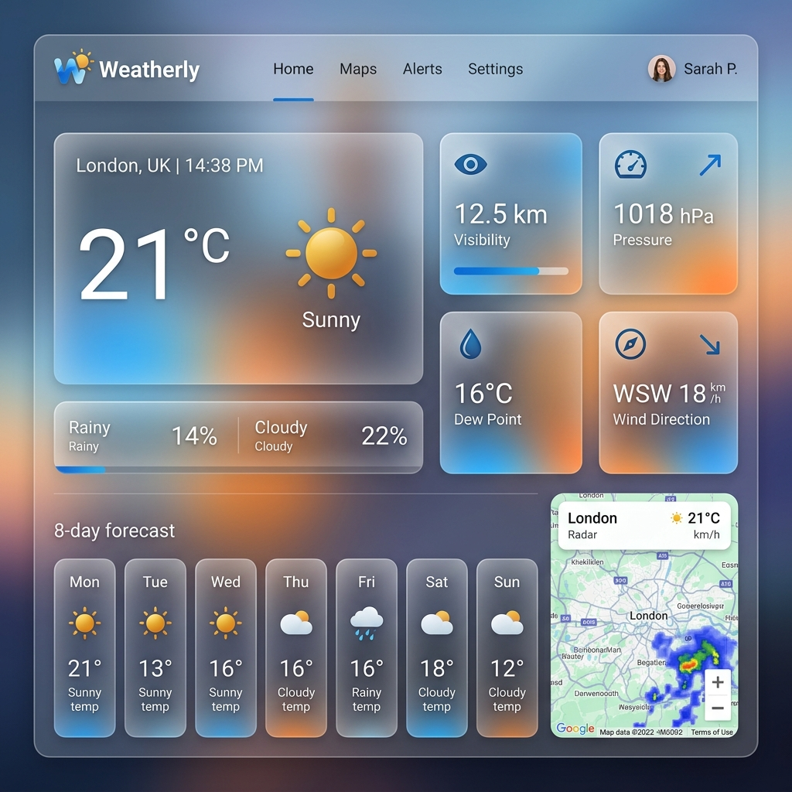

# ☁️ Weatherly

**Weatherly** is a premium, high-performance weather dashboard built with React, TypeScript, and Vite. It provides real-time local conditions with a focus on actionable daily insights and stunning visual aesthetics.



## ✨ Features

- 🛰️ **Real-time Geolocation**: Automatically detects your location to provide hyper-local weather data.
- 💎 **Glassmorphism Design**: A modern, premium UI featuring soft gradients, backdrop blurs, and Material 3 design principles.
- 📊 **Comprehensive Metrics**:
  - **Core**: Temperature, Feels Like, Humidity, Wind Speed, and UV Index.
  - **Feature Cards**: Visibility, Surface Pressure, Dew Point, and Wind Direction.
  - **Advanced**: Rain Outlook (chance and total) and Air Quality (AQI).
- 🕒 **Forecasts**:
  - **Hourly**: 24-hour horizontal scrolling forecast with precipitation probability.
  - **Daily**: 7-day overview with max/min temperatures and conditions.
- 💡 **Actionable Insights**: Context-aware recommendations for outdoor activities, UV protection, and hydration.
- 🌗 **Adaptive Themes**: Seamless transitions between light and dark modes based on system preferences.

## 🛠️ Tech Stack

- **Framework**: [React 18](https://reactjs.org/)
- **Language**: [TypeScript](https://www.typescriptlang.org/)
- **Bundler**: [Vite](https://vitejs.dev/)
- **Icons**: [Lucide React](https://lucide.dev/)
- **Styling**: Vanilla CSS with custom properties (CSS Variables)
- **API**: [Open-Meteo](https://open-meteo.com/) (Free weather & air quality data)

## 🚀 Getting Started

### Prerequisites

- [Node.js](https://nodejs.org/) (v16 or higher)
- [npm](https://www.npmjs.com/)

### Installation

1. Clone the repository:
   ```bash
   git clone https://github.com/ayeskay/weatherly.git
   cd weatherly
   ```

2. Install dependencies:
   ```bash
   npm install
   ```

3. Start the development server:
   ```bash
   npm run dev
   ```

4. Build for production:
   ```bash
   npm run build
   ```

## 📐 Design Philosophy

Weatherly follows a strict **unified grid system**. Every section (Hero, Features, Metrics) is aligned to a shared column template, ensuring a balanced and professional look across all screen sizes. The UI uses a "Panel" architecture for consistent elevation and interactive hover effects.

## 📄 License

Distributed under the MIT License. See `LICENSE` for more information.

---

Built with ❤️ by [ayeskay](https://github.com/ayeskay)
